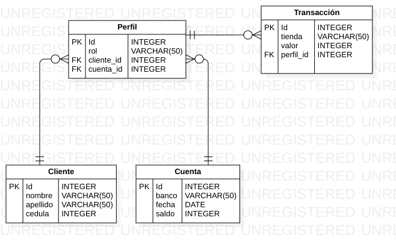

# API Cuenta con Django y DRF

## Descripción

La API fue construida con Django y la librería Django Rest Framework. Permite crear cuentas, a las cuales se les puede asociar perfiles. Un perfil se refiere al rol que tiene un cliente respecto a una cuenta. Por ejemplo, la cuenta C, es compartida por los clientes A y B, dónde el cliente A es el propietario de la cuenta y el B, es beneficiario. Por lo tanto ambos clientes A y B, pueden realizar transacciones con una misma cuenta. 

- Modelo BD

 <table class="table">
                <thead>
                    <tr>
                        <th scope="col">#</th>
                        <th scope="col">Nombre</th>
                        <th scope="col">Tipo</th>
                        <th scope="col">Link</th>
                        <th scope="col">URL</th>
                        <th scope="col">Descripción</th>
                    </tr>
                </thead>
                <tbody>
                    <tr>
                        <th scope="row">1</th>
                        <td>Cuenta List</td>
                        <td>GET</td>
                        <td><a href="">cuenta</a></td>
                        <td>/cuenta/</td>
                        <td>Lista las cuentas creadas y permite crear una nueva cuenta.</td>
                    </tr>
                    <tr>
                        <th scope="row">2</th>
                        <td>Cuenta Detail</td>
                        <td>GET/POST/DELETE/PUT</td>
                        <td><a href="1">cuenta id</a></td>
                        <td>/cuenta/{id}</td>
                        <td>Lista la cuenta correspondiente al
                            id. Permite modificar
                            y eliminar cuentas.
                        </td>
                    </tr>
                    <tr>
                        <th scope="row">3</th>
                        <td>Transaccion List</td>
                        <td>GET</td>
                        <td><a href="">transaccion</a></td>
                        <td>/transaccion/</td>
                        <td>Lista las transacciones creadas y permite crear una nueva transacción.</td>
                    </tr>
                    <tr>
                        <th scope="row">4</th>
                        <td>Transaccion Detail</td>
                        <td>GET/POST/DELETE/PUT</td>
                        <td><a href="1">transaccion id</a></td>
                        <td>/transaccion/{id}</td>
                        <td>Lista la transacción correspondiente al
                            id. Permite modificar
                            y eliminar transacciones.
                        </td>
                    </tr>
                    <tr>
                        <th scope="row">5</th>
                        <td>Perfil List</td>
                        <td>GET</td>
                        <td><a href="">perfil</a></td>
                        <td>/perfil/</td>
                        <td>Lista los perfiles creados y permite crear un nuevo perfil.</td>
                    </tr>
                    <tr>
                        <th scope="row">6</th>
                        <td>Perfil Detail</td>
                        <td>GET/POST/DELETE/PUT</td>
                        <td><a href="1">perfil id</a></td>
                        <td>/perfil/{id}</td>
                        <td>Lista el perfil correspondiente al
                            id. Permite modificar
                            y eliminar perfiles.
                        </td>
                    </tr>
                    <tr>
                        <th scope="row">7</th>
                        <td>Cliente List</td>
                        <td>GET</td>
                        <td><a href="">cliente</a></td>
                        <td>/cliente/</td>
                        <td>Lista los clientes creados y permite crear un nuevo cliente.</td>
                    </tr>
                    <tr>
                        <th scope="row">8</th>
                        <td>Cliente Detail</td>
                        <td>GET/POST/DELETE/PUT</td>
                        <td><a href="1">cliente id</a></td>
                        <td>/cliente/{id}</td>
                        <td>Lista el cliente correspondiente al
                            id. Permite modificar
                            y eliminar clientes.
                        </td>
                    </tr>
                    <tr>
                        <th scope="row">9</th>
                        <td>Add Money</td>
                        <td>PUT</td>
                        <td><a href="">add money</a></td>
                        <td>/add_money/</td>
                        <td>Permite añadir una cantidad de dinero, bien sea negativa
                            o positiva a una cuenta. Recibe un json formado por el id
                            de la cuenta y el valor a añadir, con la siguiente estructura:
                            { 'id': 1, 'deposit' : 50000 }
                        </td>
                    </tr>
                    <tr>
                        <th scope="row">10</th>
                        <td>Set zero</td>
                        <td>POST</td>
                        <td><a href="">set zero</a></td>
                        <td>/set_zero/</td>
                        <td>
                            Modifica el saldo de la cuenta relacionada con el id que
                            recibe, dejandolo en cero. Recibe un json con el id de la
                            cuenta, así: { 'id' : 1 }
                        </td>
                    </tr>
                    <tr>
                        <th scope="row">11</th>
                        <td>List tran</td>
                        <td>GET</td>
                        <td><a href="/list_tran/1">list tran</a></td>
                        <td>/list_tran/{id}</td>
                        <td>
                            Lista las transacciones de la cuenta relacionada con el id
                            que recibe a través de la url
                        </td>
                    </tr>
                </tbody>
            </table>

## Para realizar pruebas, ejecutar desde una terminal con git y docker los siguientes comandos :
- git clone https://github.com/jsparadacelis/api_cuenta.git
- cd api_cuenta
- sudo docker-compose up
- entrar a http://0.0.0.0:8000/ desde el navegador

¡ Y listo !

Para mayor información: [Documento API](DocumentoAPI.pdf)
