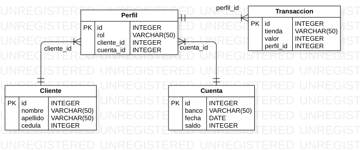

# API Cuenta con Django y DRF

## Descripción

La API fue construida con Django y la librería Django Rest Framework. Permite crear cuentas, a las cuales se les puede asociar perfiles. Un perfil se refiere al rol que tiene un cliente respecto a una cuenta. Por ejemplo, la cuenta C, es compartida por los clientes A y B, dónde el cliente A es el propietario de la cuenta y el B, es beneficiario. Por lo tanto ambos clientes A y B, pueden realizar transacciones con una misma cuenta. 

- Modelo BD

- Vistas
- Url

## Para realizar pruebas, ejecutar desde una terminal con git y docker los siguientes comandos :
- git clone https://github.com/jsparadacelis/api_cuenta.git
- cd api_cuenta
- sudo docker-compose up
- entrar a http://0.0.0.0:8000/ desde el navegador

¡ Y listo !